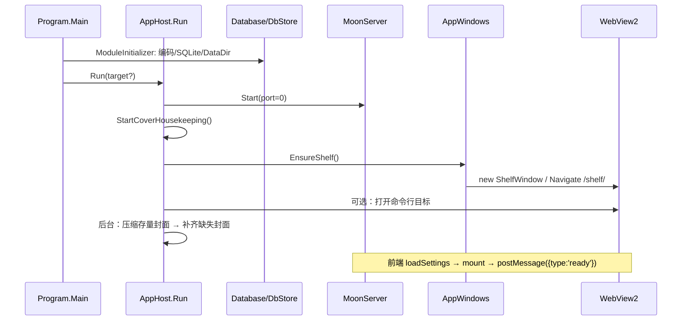
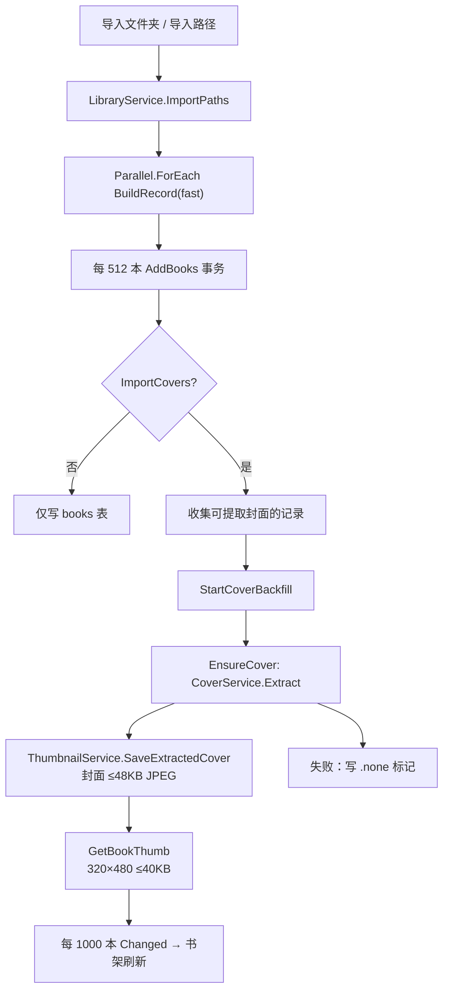
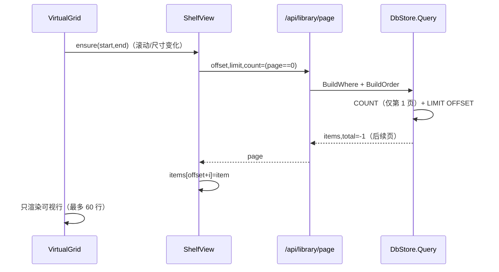
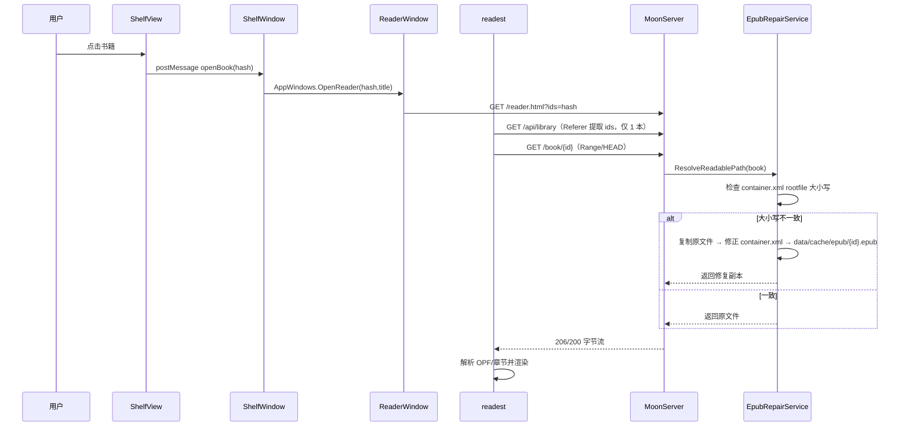
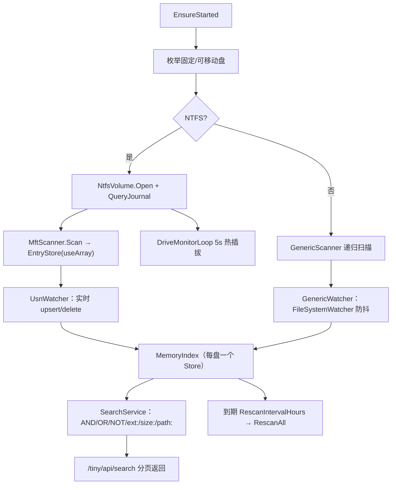
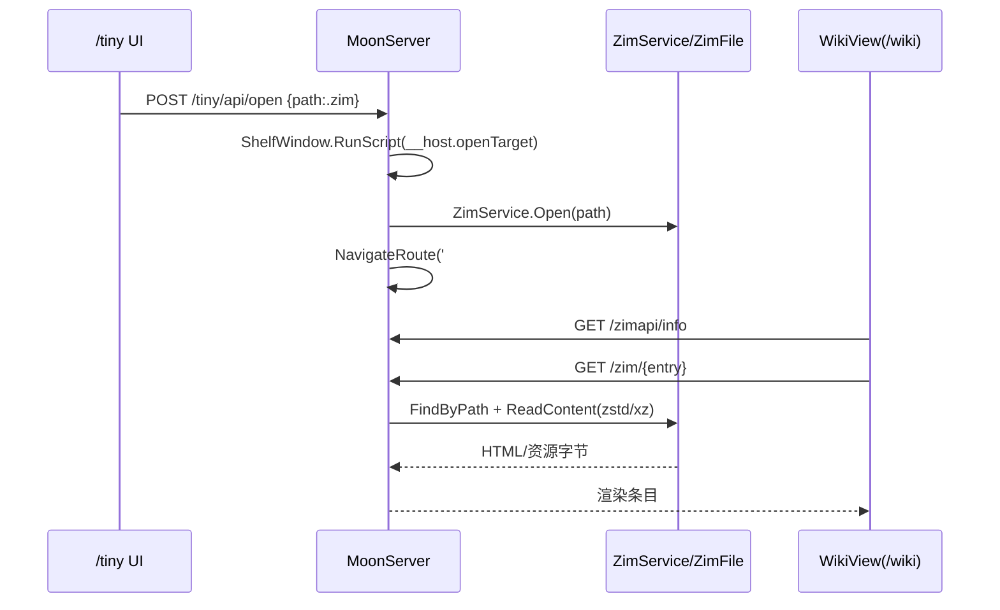
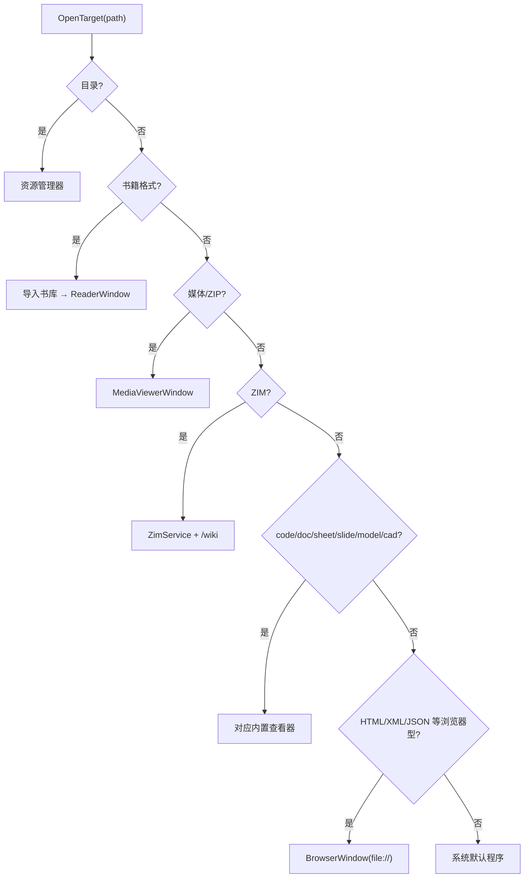

# 调用图

以下图使用 Mermaid，可直接在 GitHub 渲染。

## 1. 启动流程

```mermaid
sequenceDiagram
  participant Main as Program.Main
  participant Host as AppHost.Run
  participant DB as Database/DbStore
  participant Srv as MoonServer
  participant UI as AppWindows
  participant Win as WebView2
  Main->>DB: ModuleInitializer: 编码/SQLite/DataDir
  Main->>Host: Run(target?)
  Host->>Srv: Start(port=0)
  Host->>Host: StartCoverHousekeeping()
  Host->>UI: EnsureShelf()
  UI->>Win: new ShelfWindow / Navigate /shelf/
  Host->>Win: 可选：打开命令行目标
  Host->>Host: 后台：压缩存量封面 → 补齐缺失封面
  Note over Srv,Win: 前端 loadSettings → mount → postMessage({type:'ready'})
```

## 2. 批量导入与封面

```mermaid
flowchart TD
  A["导入文件夹 / 导入路径"] --> B["LibraryService.ImportPaths"]
  B --> C["Parallel.ForEach BuildRecord(fast)"]
  C --> D["每 512 本 AddBooks 事务"]
  D --> E{"ImportCovers?"}
  E -- 否 --> F["仅写 books 表"]
  E -- 是 --> G["收集可提取封面的记录"]
  G --> H["StartCoverBackfill"]
  H --> I["EnsureCover: CoverService.Extract"]
  I --> J["ThumbnailService.SaveExtractedCover\n封面 ≤48KB JPEG"]
  J --> K["GetBookThumb\n320×480 ≤40KB"]
  I --> L["失败：写 .none 标记"]
  K --> M["每 1000 本 Changed → 书架刷新"]
```

## 3. 书架分页与虚拟滚动

```mermaid
sequenceDiagram
  participant V as VirtualGrid
  participant S as ShelfView
  participant A as /api/library/page
  participant D as DbStore.Query
  V->>S: ensure(start,end)（滚动/尺寸变化）
  S->>A: offset,limit,count=(page==0)
  A->>D: BuildWhere + BuildOrder
  D->>D: COUNT（仅第 1 页）+ LIMIT OFFSET
  D-->>A: items,total=-1（后续页）
  A-->>S: page
  S->>S: items[offset+i]=item
  V->>V: 只渲染可视行（最多 60 行）
```

## 4. 打开阅读器与 EPUB 兼容修复

```mermaid
sequenceDiagram
  participant U as 用户
  participant S as ShelfView
  participant H as ShelfWindow
  participant W as ReaderWindow
  participant R as readest
  participant M as MoonServer
  participant E as EpubRepairService
  U->>S: 点击书籍
  S->>H: postMessage openBook(hash)
  H->>W: AppWindows.OpenReader(hash,title)
  W->>M: GET /reader.html?ids=hash
  R->>M: GET /api/library（Referer 提取 ids，仅 1 本）
  R->>M: GET /book/{id}（Range/HEAD）
  M->>E: ResolveReadablePath(book)
  E->>E: 检查 container.xml rootfile 大小写
  alt 大小写不一致
    E->>E: 复制原文件 → 修正 container.xml → data/cache/epub/{id}.epub
    E-->>M: 返回修复副本
  else 一致
    E-->>M: 返回原文件
  end
  M-->>R: 206/200 字节流
  R->>R: 解析 OPF/章节并渲染
```

## 5. 图片浏览器

```mermaid
flowchart LR
  A["打开图片 / 文件夹"] --> B["/api/images?path&recursive"]
  B --> C{"TinySearch 索引可用?"}
  C -- 是 --> D["EntryStore 子树枚举"]
  C -- 否 --> E["ImageScanService 后台递归扫描"]
  D --> F["分页返回 items + index"]
  E --> F
  F --> G["缩略图滑条 / 网格点击 → goTo"]
  G --> H["保存 media_progress: index+scale+rotation"]
  H --> I["下次打开恢复文件夹与视图状态"]
  G --> J["右键 → ImageEditor"]
  J --> K["Canvas 2D 旋转/翻转/裁剪/滤镜/缩放"]
  K --> L["/api/imageedit 保存副本或覆盖"]
```

## 6. 全盘搜索

```mermaid
flowchart TD
  A["EnsureStarted"] --> B["枚举固定/可移动盘"]
  B --> C{"NTFS?"}
  C -- 是 --> D["NtfsVolume.Open + QueryJournal"]
  D --> E["MftScanner.Scan → EntryStore(useArray)"]
  E --> F["UsnWatcher：实时 upsert/delete"]
  C -- 否 --> G["GenericScanner 递归扫描"]
  G --> H["GenericWatcher：FileSystemWatcher 防抖"]
  F --> I["MemoryIndex（每盘一个 Store）"]
  H --> I
  I --> J["SearchService：AND/OR/NOT/ext:/size:/path:"]
  J --> K["/tiny/api/search 分页返回"]
  D --> L["DriveMonitorLoop 5s 热插拔"]
  I --> M["到期 RescanIntervalHours → RescanAll"]
```

## 7. ZIM / 维基

```mermaid
sequenceDiagram
  participant T as /tiny UI
  participant S as MoonServer
  participant Z as ZimService/ZimFile
  participant W as WikiView(/wiki)
  T->>S: POST /tiny/api/open {path:.zim}
  S->>S: ShelfWindow.RunScript(__host.openTarget)
  S->>Z: ZimService.Open(path)
  S->>S: NavigateRoute('#/wiki') + ready 补发
  W->>S: GET /zimapi/info
  W->>S: GET /zim/{entry}
  S->>Z: FindByPath + ReadContent(zstd/xz)
  Z-->>S: HTML/资源字节
  S-->>W: 渲染条目
```

## 8. 文件类型分发

```mermaid
flowchart TD
  A["OpenTarget(path)"] --> B{"目录?"}
  B -- 是 --> C["资源管理器"]
  B -- 否 --> D{"书籍格式?"}
  D -- 是 --> E["导入书库 → ReaderWindow"]
  D -- 否 --> F{"媒体/ZIP?"}
  F -- 是 --> G["MediaViewerWindow"]
  F -- 否 --> H{"ZIM?"}
  H -- 是 --> I["ZimService + /wiki"]
  H -- 否 --> J{"code/doc/sheet/slide/model/cad?"}
  J -- 是 --> K["对应内置查看器"]
  J -- 否 --> L{"HTML/XML/JSON 等浏览器型?"}
  L -- 是 --> M["BrowserWindow(file://)"]
  L -- 否 --> N["系统默认程序"]
```
